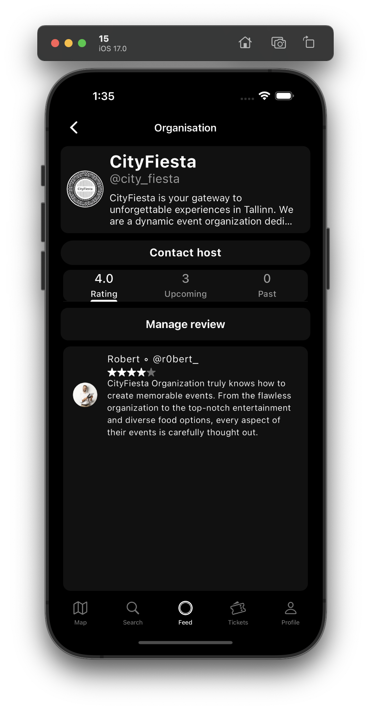
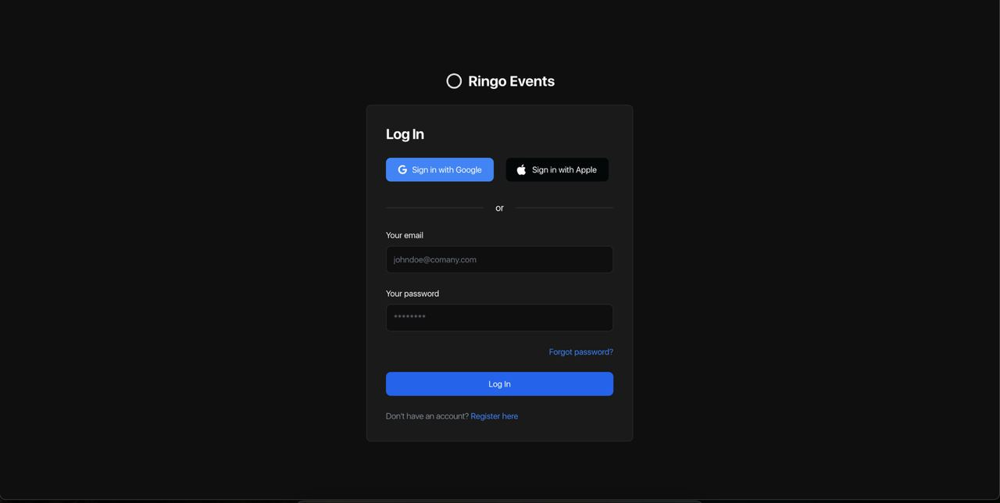
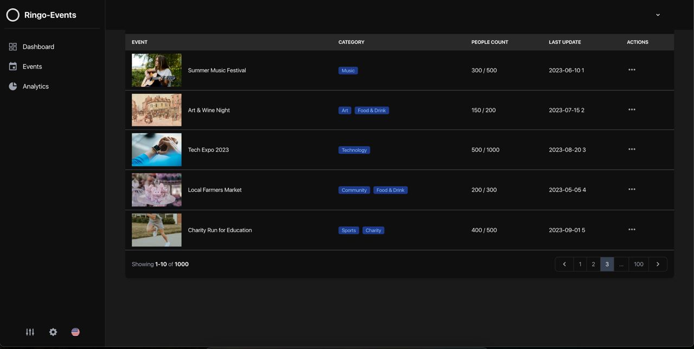
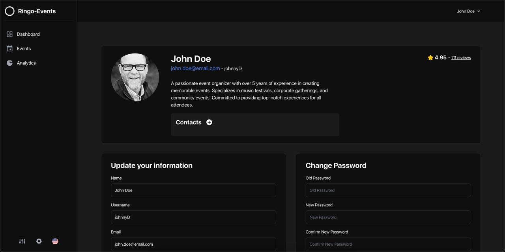

<h1> Ringo</h1>

---
## What is Ringo?
**Ringo** is an _event sharing & ticketing_ platform that allows organisations to create and share their events.  

It is user-experience focused and aims to provide a seamless experience for both the event organisers and the attendees.
Users can search for events, view event details, save events, purchase tickets and more.

The application consists of a **web app** and a **mobile app**. The web app is used by the event organisers to create and manage their events. 
The mobile app is used by the participants to view and purchase tickets for the events. 

The platform also provides a dedicated app for scanning and validating tickets.

Some of the features of the application are:
- Sign-in using Google / Apple
- Event search by distance to the user's location
- Support for multiple currencies (with automatic conversion when searching)
- Support for multiple ticket types (early bird, regular, etc.)
- Support for registration forms for events
- Users are able to review and rate organisers

---
## Technical aspects

> **_NOTE:_**  As we worked on Ringo as a team with my friends, this repository only contains my contributions to the project (Backend).

The application's backend is written in Java using the Spring Boot framework. 
We use PostgreSQL as the database and Amazon S3 for storing images. Payments are handled using _Stripe_.

Some of the features are:
- Session-less authentication using JWT tokens
- Email verification
- Ticket QR generation and validation using secure, signed tokens
- Admin panel for managing categories, currencies, etc.

---
## Tech stack

### Backend
<table>
    <tr>
        <th>
            
            
                Java
            
        </th>
        <th>
            
            
                Spring Boot
            
    </tr>
    <tr>
        <th>
            
            
                PostgreSQL
            
        </th>
        <th>
            
            
                Amazon S3
            
        </th>
    </tr>
</table>

### Web app
<table>
    <tr>
        <th>
            
            
                JavaScript
            
        </th>
        <th>
            
            
                Vue.js
            
        </th>
    </tr>
</table>

### Mobile app
<table>
    <tr>
        <th>
            
            
                Flutter
            
        </th>
        <th>
            
            
                Dart
            
        </th>
    </tr>
</table>

---
## Screenshots

### Mobile app

### Web app
 
 
 

